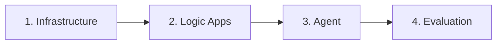

# Logic Apps CI/CD

Deploying Logic Apps that serve as Foundry agent tools.

---

## Why This Matters

If your Foundry agent uses **Logic Apps as tools** (e.g., to call APIs,
process data, or orchestrate workflows), those Logic Apps need their own
CI/CD pipeline. The agent can't work if its tools don't exist.

## Two Flavors of Logic Apps

| Aspect | Standard | Consumption |
|--------|----------|-------------|
| **Hosting** | Dedicated (App Service Plan) | Serverless (pay per execution) |
| **CI/CD method** | Zip deploy (like web apps) | ARM/Bicep templates |
| **Source format** | File-based workflows | JSON definition only |
| **IDE support** | VS Code extension ✅ | Portal or VS Code |
| **When to use** | Complex workflows, high volume | Simple integrations, low volume |

## Standard Logic Apps CI/CD

Standard Logic Apps work like Azure Functions — zip deploy:

```bash
# Build
cd logic-app-project/
zip -r ../logic-app.zip .

# Deploy
az functionapp deployment source config-zip \
  --resource-group rg-foundry-demo-dev \
  --name la-foundry-tools-dev \
  --src ../logic-app.zip
```

### In the Pipeline

```yaml
- task: AzureCLI@2
  displayName: "Deploy Logic App (Standard)"
  inputs:
    azureSubscription: "azure-dev"
    scriptType: "bash"
    inlineScript: |
      cd logic-apps/
      zip -r ../logic-app.zip .
      az functionapp deployment source config-zip \
        --resource-group $(RESOURCE_GROUP) \
        --name $(LOGIC_APP_NAME) \
        --src ../logic-app.zip
```

## Consumption Logic Apps CI/CD

Consumption Logic Apps deploy via ARM/Bicep templates:

```bicep title="infra/modules/logic-app-consumption.bicep"
resource logicApp 'Microsoft.Logic/workflows@2019-05-01' = {
  name: 'la-agent-tool-${environment}'
  location: location
  properties: {
    definition: {
      // Export from portal → paste here → parameterize
    }
    parameters: {
      // Environment-specific values
    }
  }
}
```

!!! warning "Portal-to-code workflow"
    1. Design the Logic App in the portal
    2. Export the template (Logic App → Export template)
    3. Parameterize the template for per-environment values
    4. Deploy via Bicep/ARM in your pipeline

## Deployment Order

Logic Apps **must deploy before** the agent that uses them:



```yaml
stages:
  - stage: infra
    displayName: "Deploy Infrastructure"
  - stage: logic_apps
    displayName: "Deploy Logic Apps"
    dependsOn: infra
  - stage: agent
    displayName: "Deploy Agent"
    dependsOn: logic_apps
  - stage: evaluate
    displayName: "Evaluate Agent"
    dependsOn: agent
```
