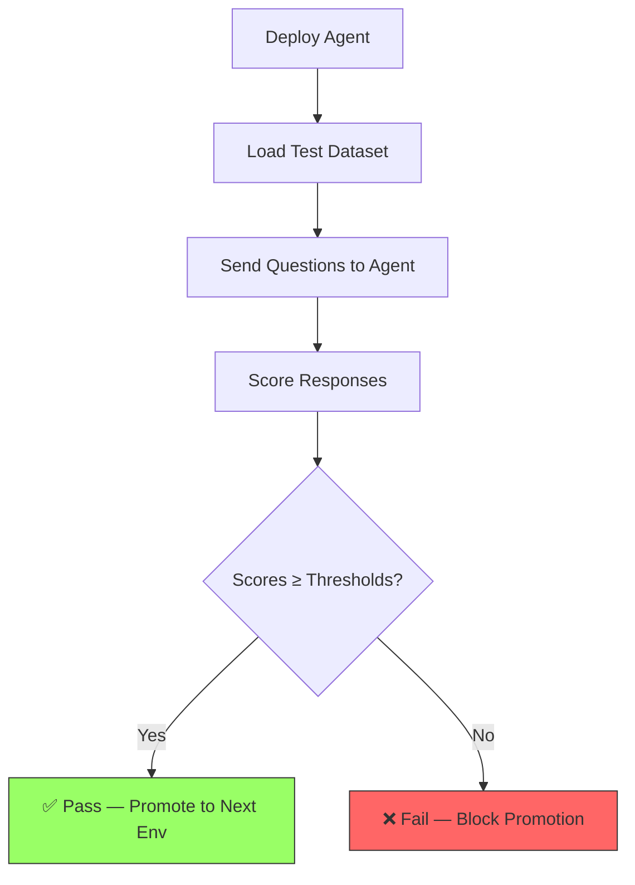

# Evaluation Quality Gates

How automated evaluation prevents bad agents from reaching production.

---

## The Problem

AI agents can regress **silently**. A small prompt change might:

- Reduce answer quality
- Introduce hallucinations
- Break tool usage patterns
- Change the agent's personality

Unit tests catch config errors but **can't catch quality regressions**.
That's what evaluation does.

## How It Works



## The Evaluation Script

```python title="src/scripts/run_evaluation.py"
# 1. Load thresholds from per-env config
thresholds = config["evaluation"]["thresholds"]
# groundedness: 3.0 (dev) → 3.5 (test) → 4.0 (prod)

# 2. Load test dataset
# src/tests/integration/eval_dataset.jsonl
# Each line: {"question": "...", "expected_answer": "..."}

# 3. Run evaluations via Foundry
# Sends questions → gets responses → scores them

# 4. Check against thresholds
if score < threshold:
    sys.exit(1)  # ❌ Fail the pipeline
```

## Thresholds by Environment

| Metric | Dev | Test | Prod | What It Measures |
|--------|-----|------|------|-----------------|
| **Groundedness** | 3.0 | 3.5 | 4.0 | Are answers based on provided context? |
| **Relevance** | 3.0 | 3.5 | 4.0 | Do answers address the question? |
| **Coherence** | 3.0 | 3.5 | 4.0 | Are answers well-structured and logical? |

!!! tip "Why lower thresholds in dev?"
    Dev is for experimentation. You want to iterate quickly without
    the quality gate blocking every change. Test and prod enforce
    higher standards progressively.

## The Test Dataset

```json title="src/tests/integration/eval_dataset.jsonl"
{"question": "What is 2 + 2?", "expected_answer": "4", "category": "math"}
{"question": "Explain what Python is in one sentence.", "expected_answer": "Python is a high-level, general-purpose programming language.", "category": "knowledge"}
```

!!! warning "Build a real dataset"
    The included dataset is minimal. For production:

    - Add 50-100 representative questions
    - Cover all tool usage scenarios
    - Include edge cases and adversarial inputs
    - Update the dataset when you add new capabilities

## Pipeline Integration

The evaluation runs **after deployment, before promotion**:

```yaml title=".github/workflows/cd.yml (excerpt)"
- name: Deploy Agent
  run: python src/scripts/deploy_agent.py --env ${{ env.AGENT_ENVIRONMENT }}

- name: Run Evaluation  # ← Quality gate
  run: python src/scripts/run_evaluation.py --env ${{ env.AGENT_ENVIRONMENT }}
  # If this fails, the pipeline stops.
  # The agent is NOT promoted to the next environment.
```
