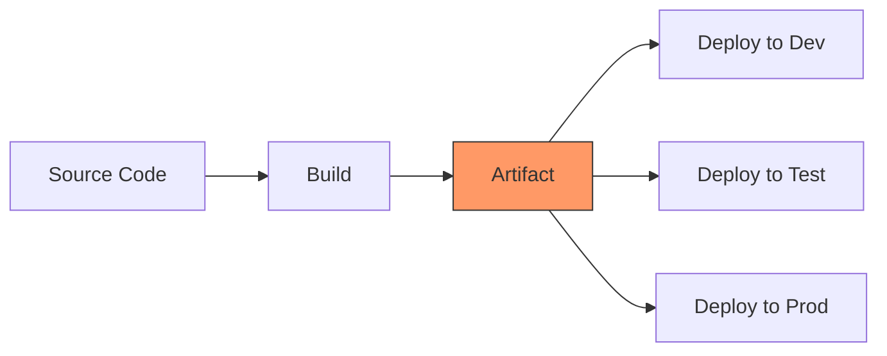
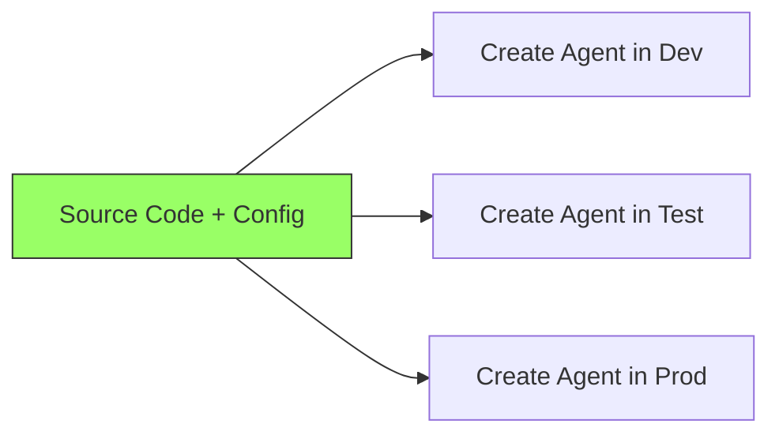

# The Mental Model

The single most important concept to understand.

---

## Traditional CI/CD vs. Foundry Agent CI/CD

### Traditional (Containers, Binaries)



You build **one artifact** and promote it through environments.
The artifact is the unit of deployment.

### Foundry Agents (No Artifact)



There is **no artifact**. The source code IS the deployable.
Each environment gets a fresh agent created from the same code
but with different config.

!!! info "Key Insight"
    There is no export/import or artifact promotion mechanism.
    Your code and config **are** the deployment unit. The SDK
    recreates the agent fresh in each environment.

## What Makes Up an Agent?

An agent is just configuration applied via the SDK:

| Component | File(s) | What It Controls |
|-----------|---------|-----------------|
| **Name** | `config/agent-config.{env}.json` | Identity in Foundry |
| **Model** | `config/agent-config.{env}.json` | Which LLM powers it |
| **System Prompt** | `src/agent/prompts/system_prompt.md` | Behavior instructions |
| **Tools** | `src/agent/tools/*.py` | What the agent can do |
| **Eval Thresholds** | `config/agent-config.{env}.json` | Quality requirements |

## The Deployment Primitive

Every deployment boils down to one SDK call:

```python
from azure.ai.projects import AIProjectClient
from azure.ai.projects.models import PromptAgentDefinition
from azure.identity import DefaultAzureCredential

client = AIProjectClient(
    endpoint="https://your-account.services.ai.azure.com/api/projects/your-project",
    credential=DefaultAzureCredential()
)

agent = client.agents.create(
    name="my-agent-dev",
    definition=PromptAgentDefinition(
        model="gpt-4o-mini",
        instructions="You are a helpful assistant...",
        tools=[{"type": "code_interpreter"}],
    ),
    metadata={"environment": "dev"},
)
```

That's it. **Everything else in this repo is plumbing around this call.**

- Config files → decide what parameters to pass
- Deploy scripts → wrap this call with error handling and logging
- CI/CD pipelines → run this call in the right environment with the right auth
- Evaluation → validate the agent works after this call

## Why Delete + Recreate?

We delete the old agent and create a fresh one on each deployment.
When delete fails (e.g., RBAC restrictions), the script falls back to updating the existing agent.

**Why not just update in place?**

1. **Guarantees consistency** — the agent matches the code exactly
2. **No drift risk** — partial updates can leave agents in inconsistent states
3. **Simpler logic** — create is idempotent, update has edge cases
4. **Audit trail** — metadata tracks which git commit is deployed

**The trade-off:**

- Agent ID changes each deployment (use names, not IDs)
- Milliseconds of "downtime" during delete → create
- Conversation threads don't carry over (by design — new deploy, fresh start)
