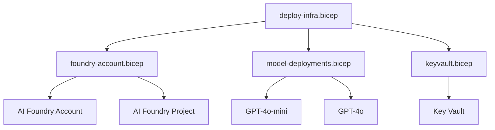

# Bicep Infrastructure

Infrastructure as Code for all Azure resources needed by your Foundry agents.

---

## Why Bicep?

Every Azure resource in this project is defined in Bicep files — no portal clicking required.
This means:

- **Reproducible** — deploy the same stack to dev, test, and prod
- **Reviewable** — infrastructure changes go through PR review just like code
- **Idempotent** — run the same deployment twice and nothing breaks
- **Auditable** — git history shows who changed what infrastructure and when

---

## What Gets Deployed



| Resource | What It Does | Created By |
|----------|-------------|------------|
| **Resource Group** | Container for all resources | `deploy-infra.bicep` (subscription-level) |
| **AI Foundry Account** | Hosts AI projects | `foundry-account.bicep` |
| **AI Foundry Project** | Contains agents, models, evaluations | `foundry-account.bicep` |
| **Model Deployments** | GPT-4o, GPT-4o-mini | `model-deployments.bicep` |
| **Key Vault** | Secrets management | `keyvault.bicep` |

---

## Module Structure

```
infra/
├── deploy-infra.bicep                ← Entry point (subscription-level)
├── main.bicep                        ← Orchestrator (resource-group-level)
├── modules/
│   ├── foundry-account.bicep         ← Account + Project
│   ├── model-deployments.bicep       ← AI model deployments
│   └── keyvault.bicep                ← Secrets management
└── environments/
    ├── dev.parameters.json           ← Dev settings
    ├── test.parameters.json          ← Test settings
    └── prod.parameters.json          ← Prod settings
```

---

## Step-by-Step: Deploy from Scratch

### 1. Authenticate

```bash
az login
az account set --subscription "My Dev Subscription"
```

### 2. Deploy Infrastructure (One Command)

The entry point is `deploy-infra.bicep` which runs at **subscription scope**
(it creates the resource group for you):

```bash
az deployment sub create \
  --location eastus2 \
  --name "manual-dev-$(date +%Y%m%d)" \
  --template-file infra/deploy-infra.bicep \
  --parameters environment=dev pipelineSource=manual \
  --parameters infra/environments/dev.parameters.json
```

!!! info "What is `pipelineSource`?"
    The `pipelineSource` parameter controls resource group naming:

    - `pipelineSource=github` → `rg-foundry-github-dev`
    - `pipelineSource=ado` → `rg-foundry-ado-dev`
    - `pipelineSource=manual` → `rg-foundry-manual-dev`

    This lets GitHub Actions and Azure DevOps pipelines deploy to the **same
    subscription** without conflicting. Each pipeline "owns" its own resource group.

### 3. Capture the Output

The deployment outputs the project endpoint you need for agent deployment:

```bash
# Query the deployment output
az deployment sub show \
  --name "manual-dev-$(date +%Y%m%d)" \
  --query "properties.outputs.projectEndpoint.value" -o tsv
```

Set it as an environment variable:

```bash
export AZURE_AI_PROJECT_ENDPOINT=$(az deployment sub show \
  --name "manual-dev-$(date +%Y%m%d)" \
  --query "properties.outputs.projectEndpoint.value" -o tsv)
```

### 4. Deploy the Agent

Now that infrastructure exists, deploy the agent into it:

```bash
python src/scripts/deploy_agent.py --env dev
```

---

## Customizing for Your Project

### Change the Resource Names

Edit `infra/environments/dev.parameters.json`:

```json
{
  "parameters": {
    "baseName": { "value": "my-project" },
    "environment": { "value": "dev" },
    "location": { "value": "westus2" }
  }
}
```

This produces resources named `my-project-dev`, `my-project-project-dev`, etc.

### Change Model Deployments

Each environment can deploy different models with different capacity:

=== "Dev"

    ```json title="infra/environments/dev.parameters.json"
    {
      "parameters": {
        "modelDeployments": {
          "value": [{
            "name": "gpt-4o-mini",
            "model": "gpt-4o-mini",
            "capacity": 10
          }]
        }
      }
    }
    ```
    Only one cheap model — dev is for fast iteration.

=== "Prod"

    ```json title="infra/environments/prod.parameters.json"
    {
      "parameters": {
        "modelDeployments": {
          "value": [{
            "name": "gpt-4o",
            "model": "gpt-4o",
            "capacity": 50
          }, {
            "name": "gpt-4o-mini",
            "model": "gpt-4o-mini",
            "capacity": 30
          }]
        }
      }
    }
    ```
    Both models, higher capacity — prod handles real traffic.

### Add New Modules

To add a new Azure resource (e.g., Azure Container Registry):

1. Create `infra/modules/acr.bicep`
2. Reference it from `infra/main.bicep`:

    ```bicep
    module acr 'modules/acr.bicep' = {
      name: 'container-registry'
      params: {
        name: 'acr${baseName}${environment}'
        location: location
      }
    }
    ```

3. Add any new outputs to `main.bicep`
4. Update parameter files if needed

---

## How the Pipeline Uses Bicep

Both GitHub Actions and Azure DevOps pipelines run the same Bicep deployment:

=== "GitHub Actions"

    ```yaml
    - name: Deploy Infrastructure
      run: |
        az deployment sub create \
          --location eastus2 \
          --template-file infra/deploy-infra.bicep \
          --parameters environment=${{ matrix.environment }} pipelineSource=github \
          --parameters infra/environments/${{ matrix.environment }}.parameters.json
    ```

=== "Azure DevOps"

    ```yaml
    - task: AzureCLI@2
      displayName: "Deploy Infrastructure"
      inputs:
        azureSubscription: "azure-dev"
        scriptType: "bash"
        scriptLocation: "inlineScript"
        inlineScript: |
          az deployment sub create \
            --location eastus2 \
            --template-file infra/deploy-infra.bicep \
            --parameters environment=$(ENVIRONMENT) pipelineSource=ado \
            --parameters infra/environments/$(ENVIRONMENT).parameters.json
    ```

The key insight: **the same Bicep files run everywhere** — locally, in GitHub Actions,
and in Azure DevOps. Only the authentication and variable substitution differ.

---

## Teardown

To remove all resources for an environment:

```bash
# Delete the resource group (this removes everything inside it)
az group delete --name rg-foundry-manual-dev --yes --no-wait
```
