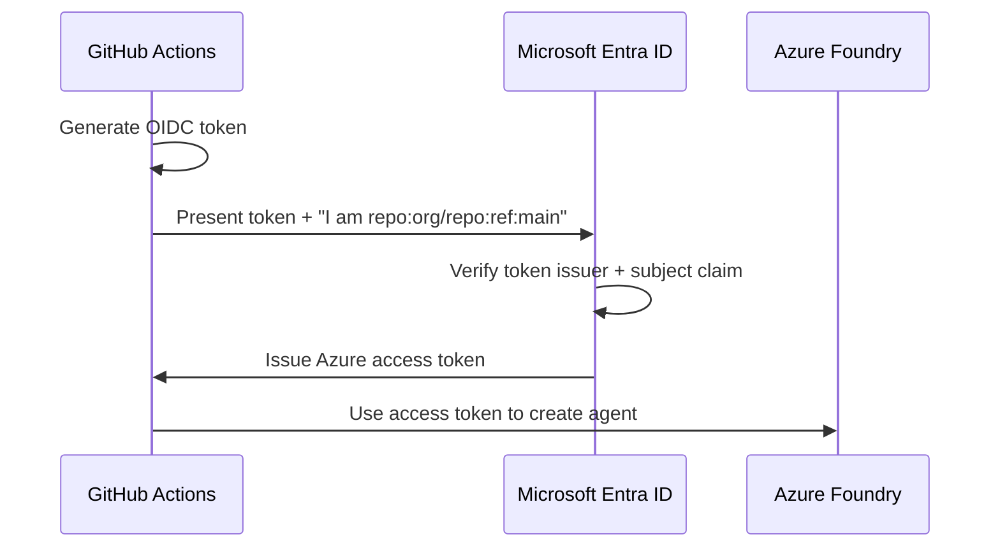

# OIDC Authentication Setup

Zero-secret authentication for CI/CD pipelines.

---

## What is OIDC?

**OpenID Connect (OIDC) federation** lets your CI/CD pipeline authenticate
to Azure **without storing any secrets**. Instead of a client secret or
certificate, Azure trusts the identity token issued by GitHub or Azure DevOps.



## Why OIDC (Not Client Secrets)?

| Approach | Security | Maintenance | Risk |
|----------|----------|-------------|------|
| **Client secret** | Secret stored in CI/CD | Rotate every 1-2 years | Secret can leak |
| **Certificate** | Cert stored in CI/CD | Rotate annually | Cert can be stolen |
| **OIDC federation** | No secrets at all ✅ | Nothing to rotate ✅ | Nothing to leak ✅ |

## Setup Steps (GitHub Actions)

### 1. Create an App Registration

```bash
# Create the app
az ad app create --display-name "foundry-agents-lifecycle"

# Note the appId (client ID) from the output
# APP_ID=<copy from output>
```

### 2. Add Federated Credential

```bash
az ad app federated-credential create \
  --id $APP_ID \
  --parameters '{
    "name": "github-main",
    "issuer": "https://token.actions.githubusercontent.com",
    "subject": "repo:ericchansen/foundry-agents-lifecycle:ref:refs/heads/main",
    "audiences": ["api://AzureADTokenExchange"],
    "description": "GitHub Actions deploying from main branch"
  }'
```

!!! warning "Subject must match exactly"
    The `subject` claim must match your repo and branch:

    - `repo:ORG/REPO:ref:refs/heads/main` — for pushes to main
    - `repo:ORG/REPO:environment:dev` — for environment deployments
    - `repo:ORG/REPO:pull_request` — for PR workflows

### 3. Create a Service Principal

```bash
az ad sp create --id $APP_ID
```

### 4. Grant Permissions

```bash
# Grant "Azure AI User" role on the Foundry account
az role assignment create \
  --assignee $APP_ID \
  --role "Azure AI User" \
  --scope /subscriptions/$SUB_ID/resourceGroups/$RG/providers/Microsoft.CognitiveServices/accounts/$ACCOUNT
```

### 5. Configure GitHub Secrets

In your repo: **Settings → Secrets and Variables → Actions**

| Secret | Value |
|--------|-------|
| `AZURE_CLIENT_ID` | App Registration's Application (client) ID |
| `AZURE_TENANT_ID` | Your Entra ID tenant ID |
| `AZURE_SUBSCRIPTION_ID` | Target Azure subscription ID |

### 6. Use in Workflow

```yaml
permissions:
  id-token: write  # Required for OIDC
  contents: read

steps:
  - uses: azure/login@v2
    with:
      client-id: ${{ secrets.AZURE_CLIENT_ID }}
      tenant-id: ${{ secrets.AZURE_TENANT_ID }}
      subscription-id: ${{ secrets.AZURE_SUBSCRIPTION_ID }}
```

## Setup Steps (Azure DevOps)

For ADO, use **Service Connections** with Workload Identity Federation:

1. **Project Settings → Service Connections**
2. **New → Azure Resource Manager**
3. Choose **Workload Identity Federation (automatic)**
4. Select your subscription and resource group
5. Name the connection (e.g., `azure-dev`)

ADO handles the federation setup automatically when you choose
"automatic" mode. It creates the app registration, federated
credential, and role assignment for you.

```yaml
# Use in your ADO pipeline:
- task: AzureCLI@2
  inputs:
    azureSubscription: "azure-dev"  # ← The Service Connection name
    scriptType: "bash"
    inlineScript: |
      python src/scripts/deploy_agent.py --env dev
```
