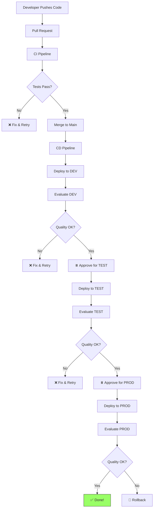

# CI/CD Pipeline Overview

How changes flow from code to production.

---

## The Full Flow

## CI vs. CD

| Aspect | CI (Continuous Integration) | CD (Continuous Deployment) |
|--------|---------------------------|---------------------------|
| **When** | On every Pull Request | On merge to `main` |
| **Purpose** | Validate changes are safe | Deploy to environments |
| **Speed** | Fast (seconds to minutes) | Slower (deploys + evals) |
| **Calls Azure?** | No (dry-run only) | Yes (creates real agents) |
| **Blocks** | PR merge | Environment promotion |

## What CI Checks

1. **Lint** — Code style and basic bugs (`ruff check`)
2. **Unit tests** — Config validation, tool testing (`pytest`)
3. **Dry-run deploy** — Config loads correctly, SDK params are valid

## What CD Does

For each environment (dev → test → prod):

1. **Authenticate** — OIDC (GitHub) or Service Connection (ADO)
2. **Deploy agent** — Create via SDK
3. **Evaluate** — Run test questions, score responses
4. **Gate** — Block if quality scores are below thresholds
5. **Wait for approval** — Human review before next environment

## Choosing Your Platform

This repo includes pipelines for both:

| Platform | Files | Best For |
|----------|-------|----------|
| [GitHub Actions](github-actions.md) | `.github/workflows/` | GitHub-native repos, OIDC |
| [Azure DevOps](azure-devops.md) | `.azdo/pipelines/` | Enterprise, ADO-native shops |

The logic is **identical** — only the YAML syntax differs.
